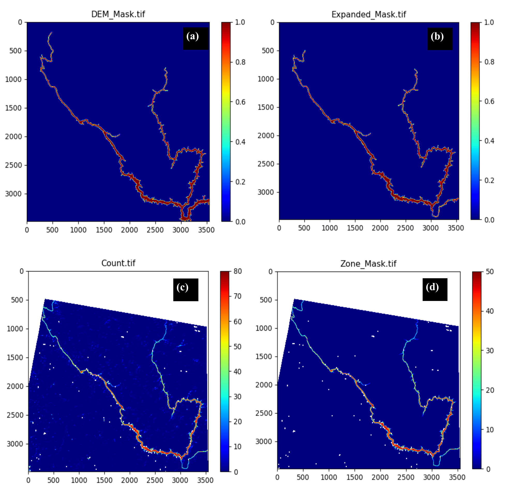

# Summary

`InfeRes` is a Python package for estimating time series of the water surface, level, and storage controlled by artificial water reservoirs. This information, rarely available, is retrieved by `InfeRes` by banking on two types of data, namely a Digital Elevation Model (DEM) and Landsat 5, 7, and 8 images. The DEM is used to identify the relationship between water surface level, and storage (bathymetric curve), while satellite images are used to estimate the water surface at the time of observation. By processing multiple images of the same reservoir and combining water surface estimates with the bathymetric curve, `InfeRes` can estimate the water storage for a given period of interest. `InfeRes` is designed to facilitate the work of hydrologists and environmental scientists that work on river basins heavily affected by reservoir operations. To this purpose, `InfeRes` automates both the download of Landsat images (using the Earth Engine Python API) and their processing. The source code for this package is freely available under the MIT license.  

# Statement of need

Accurate information concerning the amount of water stored by dams is crucial for a variety of engineering applications, such as water resources management [`@Giuliani:2021`], hydrological modelling [`@Dang:2020`], or hydropower systems management [`@Galelli:2022`]. Unfortunately, these data are rarely available, particularly in developing countries and transboundary river basins, where dam operations are often a point of contention [`@Warner:2012`]. A user necessitating information about dam storage is, in general, left with two alternatives. The first and simplest one is to retrieve such information from a database containing actual observations, such as ResOpsUS [`@Steyaert:2022`]. The problem is that the creation of these databases is still at its infancy; at this stage, their spatial coverage is limited to the United States. The second alternative is to bank on the information contained in satellite observations. By combining information on a reservoir’s bathymetry (elevation-area-storage curve) with information
on water level (measured by an altimeter), or water surface (retrieved from satellite images), one can, in principle, infer the corresponding time series of water storage [`@Gao:2015`]. The availability of such data has indeed opened up the possibility of monitoring reservoirs in ungauged areas [`@Bonnema:2017, @ Busker:2019`], and also led to the development of online monitoring tools [`@Das:2022`].

Creating storage time series for a given reservoir network is, however, not simple: water level observations provided by altimeters are relatively easy to retrieve and use, but are not available for every dam; moreover, satellite missions that included altimeters were launched only recently [`@Schwatke2015`]. Alternatively, satellite images, such as those provided by the Landsat missions, are available for longer periods of time (almost 40 years) and with global coverage. Yet, working with Landsat images requires familiarity with geospatial analysis software (e.g., ArcGIS, QGIS) as well as the statistical or traditional image analysis tools that are needed to process the images affected by cloud cover [`@Zhao:2018`]—a rather common problem in many regions, particularly during the monsoon seasons. 

Motivated by these modelling challenges, we sought to develop a package that could be potentially used to study any reservoir for a period of time that goes beyond the availability of altimeter observations. This is achieved by developing a package that can extract information from Landsat images, which have a spatial resolution of 30 meters and frequency of 16 days. `InfeRes` was created with this goal: based on the methodology first presented in `@Vu:2022`, the NASA Landsat Collection 2 top-of-atmosphere (TOA) reflectance, the OSGeo package ['@Coetzee:2020'], and scikit-learn library ['@Hao:2019']. `InfeRes` automates three key modelling steps, namely data download, image processing, and time series reconstruction. With minimal input data required (dam location and design specifications), `InfeRes` is easy to use, even for users unfamiliar with remote sensing and image classification techniques and thus expected to provide an entry point for many users. 

# Functionality

`InfeRes` is available on GitHub (https://github.com/Critical-Infrastructure-Systems-Lab/InfeRes). Its documentation (https://inferes-test.readthedocs.io/en/latest/index.html) provides a detailed explanation of the installation steps and guidelines for running the code. This includes the preparation of the required modules, which can be easily imported in the Python environment via the pip, conda, or conda-forge package manager.

The package's core functionality is divided into two main modules, which are run in sequence. The first module (`data_download.py`) downloads the Landsat imageries using the Earth Engine Python API. To that purpose, the user needs to install the *earthengine-api* package and authenticate with the Google Earth Engine account. In principle, the user can download any set of data from the Google Earth Engine using `data_download.py`; however, for the current objective, we simply use the Normalised Difference Water Index (NDWI) and Quality Assessment Bands (QA_PIXEL) from the Landsat data collection. Alternatively, the user can also download the GREEN and NIR bands to calculate NDWI, instead of downloading NDWI directly from the Earth Engine. Note that more storage and time would be required in such case. The data download module also helps users change the data specifications, such as satellite sensor, area of interest, spatial resolution, and selection of bands. The time needed for data download depends on the size of the Landsat images. For instance, when tested on one of the biggest reservoir area (3010 x 5413 pixels of 30 m resolution), it took around 6-8 hours to download 1330 Landsat images (Landsat 5, 7, and 8), which required nearly 45 GB of storage. 

The second module (`data_processing.py`) includes four sub-modules that are designed to execute one after another to get the complete set of results. The four sub modules are: **CURVE.py**, **MASK.py**, **WSA.py**, and **CURVE_Tile.py**. Apart from the Landsat images, the user needs the DEM of the selected reservoir (with the same dimension of the Landsat images), which is an input to the sub-modules. We recommend users to get the DEM separately before running the code. Please note that the DEM should have been created before the reservoir is filled. We tested our code with SRTM DEM (30m) which was acquired in the year 2000. If the reservoir is constructed before the DEM was created, the software provides the bathymetric curves for water level above the DEM observation point (so this may require the user to complete the bathymetric curve via extrapolation). As the user runs the data processing module, the **CURVE.py** is executed first, generating the reservoir's bathymetric curve (using the information contained in the DEM). Next, **MASK.py** takes the Landsat images and DEM as input (together with the design specifications i.e. dam location, extent of the reservoir, maximum and dead storage level, and year of commission) and generates the supporting intermediate files required to run **WSA.py**. This sub-module works with supporting files and processed Landsat images to calculate the reservoir surface water area. Finally, **CURVE_Tile.py** translates the reservoir's surface water area into its corresponding storage volume and level using the previously constructed bathymetric curve.
             
# Example Use Case

We showcase the application of `InfeRes` to two different dams: Xiaowan (containing one Landsat tile) and Nuozhadu (containing two tiles), built in the years 2010 and 2014 in the Upper Mekong River basin. Note that if a reservoir falls across multiple adjacent Landsat tiles (like Nuozhadu), the user should download the tile that contains the biggest portion of the reservoir, as illustrated in Figure 1. Since the likelihood of getting two images of the same date is low, we do not recommend to merge two tiles. Merging tiles of different acquisition dates is not meaningful, and it's also not advisable to compromise with fewer merged (same date) images. 

 
Figure 1. Illustration of the selection of Landsat tile for One-Tile (Xiaowan, Left), and Two-Tile (Nuozhadu, Right) reservoir.   

In this example, since Xiaowan reservoir area is falling within one tile, we simply downloaded the tile (Path- 131, Row-43) for Xiaowan reservoir and ran the modules. However, in the case of Nuozhadu, two tiles need to be merged to get the total reservoir area. Therefore, we only downloaded the tile (Path- 131, Row-44) that contained the biggest are of the reservoir, and not the other one. The module (**MASK.py**) ran with the biggest tile and estimated the corresponding water-surface area, which was later converted to the total reservoir’s water surface area using bathymetric curve of the complete reservoir.

Operatively, we assigned a parent directory and ran the module `data_download.py`, which created a folder (*LandsatData*) and downloaded all the requested Landsat images (NDWI and QA_PIXEL). We then provided the static reservoir information (location, extent, maximum and dead water level) and ran the second module, `data_processing.py`. Please note that we specified both the extents (bigger portion and complete reservoir) for the Nuozhadu reservoir in the user input section (see Figure 1). Then, the package created another folder (*LandsatData_Clip*) and stored the modified NDWI images after applying the cloud mask information from the QA_PIXEL. Subsequently, it also generated the intermediate files and saved them into a different folder (*Outputs*). The intermediate files obtained for the Xiaowan reservoir are shown in Figure 2. The desired final outputs for Xiaowan and Nuozhadu were finally saved in **WSA_Complete_Xiaowan.csv** and **WSA_Complete_Nuozhadu.csv**, respectively.

 
**Figure 2. (a) DEM-based mask**- a spatial mask of the reservoir’s maximum surface water extent created using digital elevation model corresponding to the full reservoir level, **(b) Landsat-based mask**- same as (a) but created using average of all selected non-cloudy (< 20% cloud coverage over the reservoir) Landsat images, **(c) Frequency map**- map showing the number of images used to make the Landsat-based mask, and **(d) Zone mask**- rescaled frequency map ranging from 0 and 50 (user defined range).   

# Development Notes

`InfeRes` is developed on GitHub as an open-source package, and the authors welcome
contributions and feature suggestions. We ensure the code's quality with an extensive suite of tests on multiple reservoirs. Note that the package is only tested on Python 3.8, because of its dependency on the GDAL package. The documentation is created with Sphinx and hosted on Read the Docs. 

# Figures

and referenced from text using \autoref{fig:example}.

# Acknowledgments 

This research ‘On the origin of droughts in Mainland Southeast Asia—implications for water and energy security’ is supported by Singapore’s Ministry of Education (MoE) under its Academic Research Fund Tier 2, Project ID: MOE-000379-00 / MOE-000379-01, Award Number: MOE-T2EP50122-0004” XX).

# References
